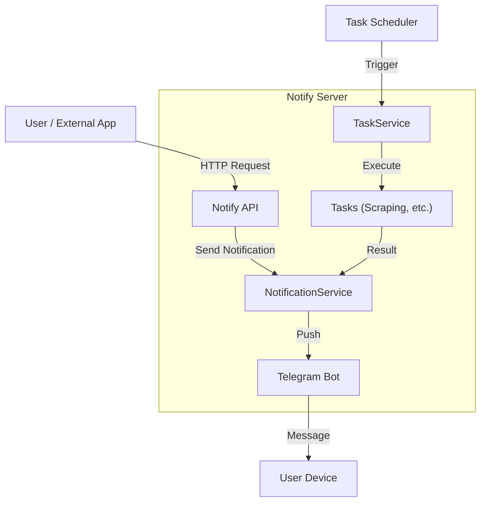
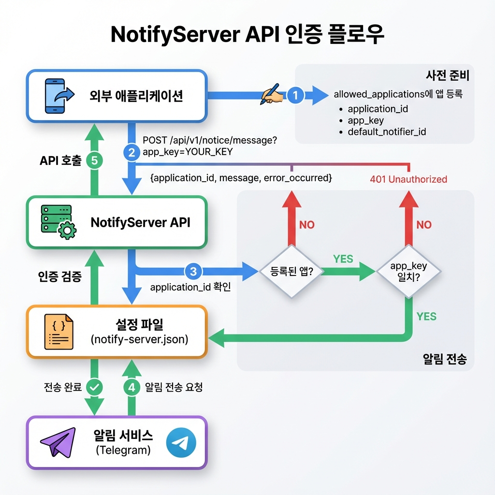

# NotifyServer

<p align="center">
  
  
  
  
  <a href="LICENSE">
    
  </a>
</p>

웹 페이지 스크래핑을 통해 정보를 수집하고, 텔레그램 등의 메신저로 알림을 전송하는 서버입니다.

## 목차

- [주요 기능](#주요-기능)
- [아키텍처](#아키텍처)
- [기술 스택](#기술-스택)
- [시작하기](#시작하기)
- [설정 가이드](#설정-가이드)
- [API 문서](#api-문서)
- [개발 가이드](#개발-가이드)
- [CI/CD](#cicd)

## 주요 기능

### 알림 시스템

- 텔레그램 봇 연동 (확장 가능한 구조)
- REST API를 통한 외부 애플리케이션 연동

### 스케줄링

- Cron 표현식 기반 작업 스케줄링
- 정기적인 자동 실행

### 웹 스크래핑

- **쇼핑몰 가격 모니터링**: 네이버 쇼핑, 마켓컬리
- **공지사항 모니터링**: 학교, 관공서 등
- **공연 정보 수집**: 네이버 공연 검색
- **로또 번호 예측**: 외부 Java 프로그램 연동

### 모니터링

- 헬스체크 엔드포인트
- Swagger API 문서

## 아키텍처



## 기술 스택

| 카테고리      | 기술             | 버전        |
| ------------- | ---------------- | ----------- |
| 언어          | Go               | 1.24+       |
| 웹 프레임워크 | Echo             | v4          |
| 스케줄러      | Cron             | v3          |
| 문서화        | Swagger (Swaggo) | Latest      |
| 컨테이너      | Docker           | Alpine 3.20 |
| CI/CD         | Jenkins          | Latest      |
| 코드 품질     | golangci-lint    | v1.62+      |

## 시작하기

### 전제 조건

- Docker & Docker Compose
- Go 1.24+ (로컬 개발 시)
- Telegram 봇 토큰 ([@BotFather](https://t.me/botfather)에서 발급)
- Telegram Chat ID ([@userinfobot](https://t.me/userinfobot)에서 확인)

### Docker로 실행

#### 1. 이미지 빌드

```bash
docker build -t darkkaiser/notify-server .
```

#### 2. 컨테이너 실행

```bash
docker rm -f notify-server || true

docker run -d --name notify-server \
  -e TZ=Asia/Seoul \
  -v $(pwd)/secrets:/usr/local/app/secrets \
  -v $(pwd)/logs:/usr/local/app/logs \
  -p 2443:2443 \
  --restart="always" \
  darkkaiser/notify-server
```

### 로컬에서 실행

#### 1. 의존성 설치

```bash
go mod download
```

#### 2. Swagger 문서 생성

```bash
swag init
```

#### 3. 서버 실행

```bash
go run main.go
```

> 로컬 실행 시 `notify-server.json` 설정 파일이 필요합니다.

## 설정 가이드

### 기본 설정

`notify-server.json` 파일을 통해 서버를 설정합니다.

```json
{
  "debug": true,
  "http_retry": {
    "max_retries": 3,
    "retry_delay": "2s"
  },
  "notifiers": {
    "default_notifier_id": "my-telegram",
    "telegrams": [
      {
        "id": "my-telegram",
        "bot_token": "YOUR_BOT_TOKEN",
        "chat_id": 123456789
      }
    ]
  },
  "tasks": [
    {
      "id": "my-task",
      "title": "My Task",
      "commands": [
        {
          "id": "my-command",
          "title": "My Command",
          "description": "My Command Description",
          "scheduler": {
            "runnable": true,
            "time_spec": "* * * * * *"
          },
          "notifier": {
            "usable": true
          },
          "default_notifier_id": "my-telegram"
        }
      ]
    }
  ],
  "notify_api": {
    "ws": {
      "tls_server": false,
      "tls_cert_file": "",
      "tls_key_file": "",
      "listen_port": 2443
    },
    "applications": [
      {
        "id": "my-app",
        "title": "My Application",
        "description": "My Application Description",
        "default_notifier_id": "my-telegram",
        "app_key": "your-secret-key-here"
      }
    ]
  }
}
```

### 주요 설정 항목

| 항목                            | 설명                            | 필수             |
| ------------------------------- | ------------------------------- | ---------------- |
| `debug`                         | 디버그 모드 활성화              | 아니오           |
| `http_retry.max_retries`        | HTTP 요청 최대 재시도 횟수      | 아니오           |
| `http_retry.retry_delay`        | 재시도 대기 시간                | 아니오           |
| `notifiers.default_notifier_id` | 기본 알림 채널 ID               | 예               |
| `notifiers.telegrams`           | Telegram 봇 설정                | 예               |
| `tasks`                         | 실행할 작업 목록                | 예               |
| `notify_api.ws.listen_port`     | API 서버 포트                   | 예               |
| `notify_api.ws.tls_server`      | HTTPS 사용 여부                 | 아니오           |
| `notify_api.ws.tls_cert_file`   | TLS 인증서 파일 경로            | HTTPS 사용 시 예 |
| `notify_api.ws.tls_key_file`    | TLS 키 파일 경로                | HTTPS 사용 시 예 |
| `notify_api.applications`       | API 접근 허용 애플리케이션 목록 | 예               |

자세한 Task 설정은 [TASKS.md](docs/TASKS.md)를 참조하세요.

### API 인증 플로우

NotifyServer API는 App Key 기반 인증을 사용합니다. 다음 다이어그램은 인증 과정을 보여줍니다.



**인증 단계**:

1. **사전 준비**: `notify-server.json`의 `allowed_applications`에 애플리케이션 등록
2. **API 호출**: Query Parameter로 `app_key` 전달
3. **인증 검증**:
   - `application_id` 확인
   - `app_key` 일치 여부 확인
4. **알림 전송**: 인증 성공 시 텔레그램으로 메시지 전송

**설정 예시**:

```json
{
  "notify_api": {
    "allowed_applications": [
      {
        "id": "my-app",
        "title": "My Application",
        "app_key": "your-secret-key-here",
        "default_notifier_id": "my-telegram"
      }
    ]
  }
}
```

**API 호출 예시**:

```bash
curl -X POST "http://localhost:2443/api/v1/notice/message?app_key=your-secret-key-here" \
  -H "Content-Type: application/json" \
  -d '{
    "application_id": "my-app",
    "message": "테스트 메시지입니다.",
    "error_occurred": false
  }'
```

## API 문서

서버 실행 후 Swagger UI를 통해 API 문서를 확인할 수 있습니다.

- **Swagger UI**: `https://api.darkkaiser.com:2443/swagger/index.html`
- **Health Check**: `https://api.darkkaiser.com:2443/health`

## 개발 가이드

### 프로젝트 구조

```
notify-server/
├── config/            # 환경설정 관리
├── docs/              # 문서 (TASKS.md, Swagger 등)
├── pkg/               # 재사용 가능한 패키지
│   ├── errors/        # 커스텀 에러 타입
│   ├── log/           # 로깅 유틸리티
│   ├── strutil/       # 문자열 유틸리티 함수
│   └── validation/    # 검증 함수 (Cron, Port, Duration 등)
├── logs/              # 로그 파일 저장소 (Git 제외)
├── secrets/           # 민감 정보 및 설정 파일 (Git 제외)
├── service/           # 비즈니스 로직
│   ├── api/           # REST API 서버
│   ├── notification/  # 알림 발송 (Telegram 등)
│   └── task/          # 스케줄링 및 스크래핑 작업
├── main.go            # 애플리케이션 진입점
├── notify-server.json # 기본 설정 파일
└── Dockerfile         # Docker 빌드 설정
```

### 로깅 시스템

`notify-server`는 구조화된 로깅과 민감 정보 마스킹을 지원합니다.

- **구조화된 로그**: 모든 로그는 `component` 필드를 포함하여 출처를 명확히 식별할 수 있습니다.
- **민감 정보 마스킹**: `bot_token`, `app_key` 등 민감한 정보는 로그 출력 시 자동으로 마스킹(`***`) 처리됩니다.
- **로그 레벨**:
  - `DEBUG`: 개발 및 디버깅용 상세 정보
  - `INFO`: 주요 이벤트 및 정상 작동 확인
  - `WARN`: 잠재적 문제, 재시도, 클라이언트 에러
  - `ERROR`: 시스템 에러, 작업 실패
  - `FATAL`: 치명적 오류 (서버 종료)

### 에러 처리

`notify-server`는 `pkg/errors` 패키지를 사용하여 일관된 에러 처리를 지원합니다.

- **커스텀 에러 타입**: `ErrInvalidInput`, `ErrNotFound`, `ErrInternal` 등 명확한 에러 타입을 정의하여 사용합니다.
- **에러 래핑**: `apperrors.Wrap`을 사용하여 원인 에러와 컨텍스트 정보를 함께 전달합니다.
- **에러 확인**: `apperrors.Is`, `apperrors.As`를 사용하여 에러 타입과 원인을 안전하게 확인합니다.
- **에러 핸들링**: `apperrors.CheckErr`를 사용하여 에러 발생 시 설정된 핸들러(기본값: Fatal)를 통해 처리합니다.

### 검증 시스템

`pkg/validation` 패키지는 설정 값 검증을 위한 재사용 가능한 함수들을 제공합니다.

- **Cron 표현식 검증**: `ValidateRobfigCronExpression` - robfig/cron 패키지 기반, 초 단위 포함 7필드 형식 지원
- **포트 번호 검증**: `ValidatePort` - TCP/UDP 포트 범위(1-65535) 검증, 시스템 예약 포트 경고
- **Duration 검증**: `ValidateDuration` - Go duration 문자열 형식 검증 (예: "2s", "100ms", "1m")
- **파일 존재 검증**: `ValidateFileExists` - 파일 경로 존재 여부 확인
- **URL 검증**: `ValidateURL` - HTTP/HTTPS URL 형식 검증
- **파일/URL 검증**: `ValidateFileExistsOrURL` - 파일 또는 URL 유효성 검증
- **중복 검증**: `ValidateNoDuplicate` - 목록 내 중복 값 검사

### 코드 품질 관리

```bash
# 린트 검사 실행
golangci-lint run ./...
```

### 테스트

```bash
# 전체 테스트 실행
go test ./... -v

# 커버리지 포함 테스트
go test ./... -v -coverprofile=coverage.out

# 커버리지 리포트 확인
go tool cover -html=coverage.out

# 벤치마크 테스트
go test ./... -bench=. -benchmem
```

### 테스트 구조

| 테스트 유형     | 설명                           | 파일 패턴               |
| --------------- | ------------------------------ | ----------------------- |
| 단위 테스트     | 각 모듈의 핵심 로직 검증       | `*_test.go`             |
| 통합 테스트     | 실제 웹 페이지 스크래핑 테스트 | `*_integration_test.go` |
| 벤치마크 테스트 | 성능 측정 및 최적화            | `*_benchmark_test.go`   |

### 빌드

```bash
# 로컬 빌드
go build -o notify-server .

# Docker 빌드 (테스트 포함)
docker build -t darkkaiser/notify-server .

# 특정 버전 태그로 빌드
docker build -t darkkaiser/notify-server:1.0.0 .
```

## CI/CD

Jenkins를 통한 자동화된 빌드 및 배포 파이프라인이 구축되어 있습니다.

### 파이프라인 단계

| 단계               | 설명                    | 주요 작업                                |
| ------------------ | ----------------------- | ---------------------------------------- |
| 환경 검증          | 필수 환경 변수 확인     | `TELEGRAM_BOT_TOKEN`, `TELEGRAM_CHAT_ID` |
| 소스 체크아웃      | Git 소스 코드 체크아웃  | 서브모듈 포함                            |
| 테스트 & 품질 검사 | 테스트 및 커버리지 수집 | `go test`, `coverage.out` 아카이빙       |
| 이미지 빌드        | Docker 이미지 빌드      | `latest`, `{빌드번호}-{커밋해시}` 태그   |
| 컨테이너 배포      | 새 컨테이너 실행        | 기존 컨테이너 안전 교체                  |
| 이미지 정리        | 오래된 이미지 삭제      | 최근 5개 버전만 유지                     |
| 알림 전송          | 빌드 결과 알림          | Telegram 메시지 전송                     |

### 빌드 메타데이터

빌드된 이미지에는 다음 정보가 포함됩니다:

| 메타데이터     | 설명              | 예시                   |
| -------------- | ----------------- | ---------------------- |
| `GIT_COMMIT`   | Git 커밋 해시     | `abc1234`              |
| `BUILD_DATE`   | 빌드 시간 (UTC)   | `2025-12-01T14:00:00Z` |
| `BUILD_NUMBER` | Jenkins 빌드 번호 | `100`                  |

### 버전 관리

| 태그                    | 설명           | 용도          |
| ----------------------- | -------------- | ------------- |
| `latest`                | 항상 최신 빌드 | 프로덕션 배포 |
| `{빌드번호}-{커밋해시}` | 특정 버전      | 롤백, 디버깅  |

예시: `100-abc1234`, `101-def5678`

### 롤백

```bash
docker stop notify-server
docker rm notify-server
docker run -d --name notify-server \
  -e TZ=Asia/Seoul \
  -v /usr/local/docker/notify-server:/usr/local/app \
  -p 2443:2443 \
  --restart="always" \
  darkkaiser/notify-server:100-abc1234
```

### 로그 확인

| 명령어                                 | 설명            |
| -------------------------------------- | --------------- |
| `docker logs notify-server`            | 전체 로그       |
| `docker logs -f notify-server`         | 실시간 로그     |
| `docker logs --tail 100 notify-server` | 최근 100줄      |
| `docker logs -t notify-server`         | 타임스탬프 포함 |
| `docker logs --since 1h notify-server` | 최근 1시간      |

## Contributing

Contributions, issues and feature requests are welcome.  
Feel free to check [issues page](https://github.com/DarkKaiser/notify-server/issues) if you want to contribute.

## Author

**DarkKaiser**

- Blog: [@DarkKaiser](https://www.darkkaiser.com)
- Github: [@DarkKaiser](https://github.com/DarkKaiser)
