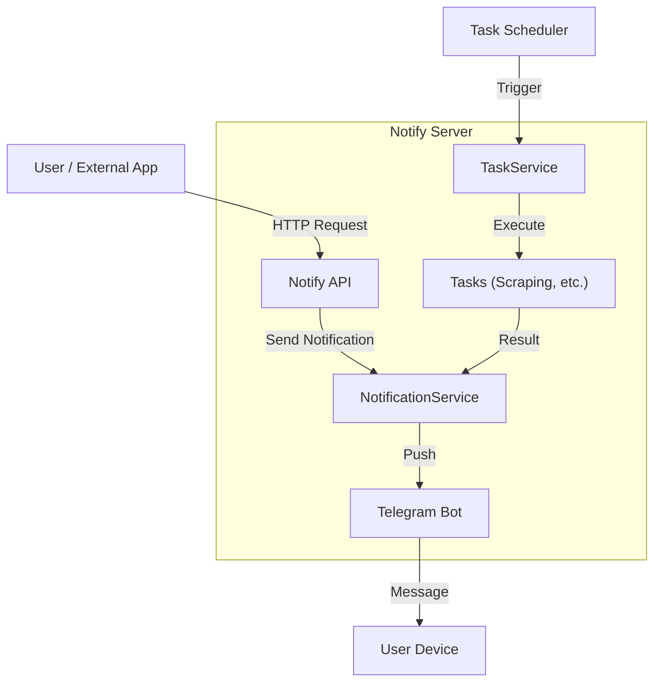

# NotifyServer

<p align="center">
  
  
  
  
  <a href="LICENSE">
    
  </a>
</p>

NotifyServer는 웹 스크래핑, 스케줄링, 외부 API 연동을 통해 다양한 정보를 수집하고, 텔레그램 등 메신저로 알림을 전송하는 통합 알림 서버입니다.

## 📚 목차

- [주요 기능](#-주요-기능)
- [아키텍처](#-아키텍처)
- [기술 스택](#-기술-스택)
- [시작하기](#-시작하기)
  - [전제 조건](#전제-조건)
  - [Docker로 실행](#docker로-실행)
  - [로컬에서 실행](#로컬에서-실행)
- [설정 가이드](#-설정-가이드)
- [API 문서](#-api-문서)
- [개발 가이드](#-개발-가이드)
- [CI/CD](#-cicd)

## 🌟 주요 기능

- **다양한 알림 채널**: 텔레그램 봇 연동 (확장 가능한 구조)
- **강력한 스케줄링**: Cron 표현식을 사용한 정기적인 작업 실행
- **웹 스크래핑**:
  - 쇼핑몰 가격 변동 감지 (네이버 쇼핑, 마켓컬리)
  - 공지사항 모니터링 (학교, 관공서)
  - 로또 번호 예측 및 당첨 확인
- **REST API**: 외부 애플리케이션 연동을 위한 API 제공
- **상태 모니터링**: 헬스체크 및 Swagger API 문서 제공

## 🏗 아키텍처



## 🛠 기술 스택

- **Language**: Go 1.23
- **Web Framework**: Echo v4
- **Documentation**: Swagger (Swaggo)
- **Container**: Docker (Alpine 3.20)
- **CI/CD**: Jenkins
- **Linting**: golangci-lint

## 🚀 시작하기

### 전제 조건

- Docker & Docker Compose
- Go 1.23+ (로컬 개발 시)

### Docker로 실행

1. **이미지 빌드**

   ```bash
   docker build -t darkkaiser/notify-server .
   ```

2. **컨테이너 실행**

   ```bash
   # 기존 컨테이너 정리 및 실행
   docker rm -f notify-server || true

   docker run -d --name notify-server \
     -e TZ=Asia/Seoul \
     -v $(pwd)/secrets:/usr/local/app/secrets \
     -v $(pwd)/logs:/usr/local/app/logs \
     -p 2443:2443 \
     --restart="always" \
     darkkaiser/notify-server
   ```

### 로컬에서 실행

1. **의존성 설치**

   ```bash
   go mod download
   ```

2. **Swagger 문서 생성**

   ```bash
   swag init
   ```

3. **서버 실행**

   ```bash
   go run main.go
   ```

## 📝 설정 가이드

`notify-server.json` 파일을 통해 서버 동작을 설정합니다.

```json
{
  "debug": true,
  "notifiers": {
    "default_notifier_id": "my-telegram",
    "telegrams": [
      {
        "id": "my-telegram",
        "bot_token": "YOUR_BOT_TOKEN",
        "chat_id": 123456789
      }
    ]
  },
  "notify_api": {
    "ws": {
      "listen_port": 2443,
      "tls_server": false
    }
  }
}
```

## 📚 API 문서

서버가 실행 중일 때 Swagger UI를 통해 API 문서를 확인하고 테스트할 수 있습니다.

- **Swagger UI**: `https://api.darkkaiser.com::2443/swagger/index.html`
- **Health Check**: `https://api.darkkaiser.com::2443/swagger/index.html` (200 OK)

## 💻 개발 가이드

### 코드 품질 관리

프로젝트는 `golangci-lint`를 사용하여 코드 품질을 유지합니다.

```bash
# 린트 검사 실행
golangci-lint run ./...
```

### 테스트 실행

```bash
# 전체 테스트 실행
go test ./... -v
```

### 빌드

```bash
# 바이너리 빌드
go build -o notify-server .
```

## 🔧 CI/CD

Jenkins를 통해 자동화된 빌드 및 배포 파이프라인이 구축되어 있습니다.

### 파이프라인 단계

1. **환경 검증**: 필수 환경 변수 확인
2. **테스트 & 린트**: `go test` 및 `golangci-lint` 실행
3. **빌드**: Docker 이미지 빌드 (Git 커밋 해시 태그)
4. **배포**: 컨테이너 자동 재시작
5. **알림**: Telegram으로 빌드 결과 전송

### 빌드 메타데이터

빌드된 이미지에는 다음 정보가 포함됩니다:

- Git 커밋 해시 (`GIT_COMMIT`)
- 빌드 시간 (`BUILD_DATE`)
- 빌드 번호 (`BUILD_NUMBER`)

확인 방법:

```bash
docker inspect darkkaiser/notify-server:latest | grep Labels -A 10
```

## 🤝 Contributing

Contributions, issues and feature requests are welcome.<br />
Feel free to check [issues page](https://github.com/DarkKaiser/notify-server/issues) if you want to contribute.

## Author

👤 **DarkKaiser**

- Blog: [@DarkKaiser](https://www.darkkaiser.com)
- Github: [@DarkKaiser](https://github.com/DarkKaiser)
