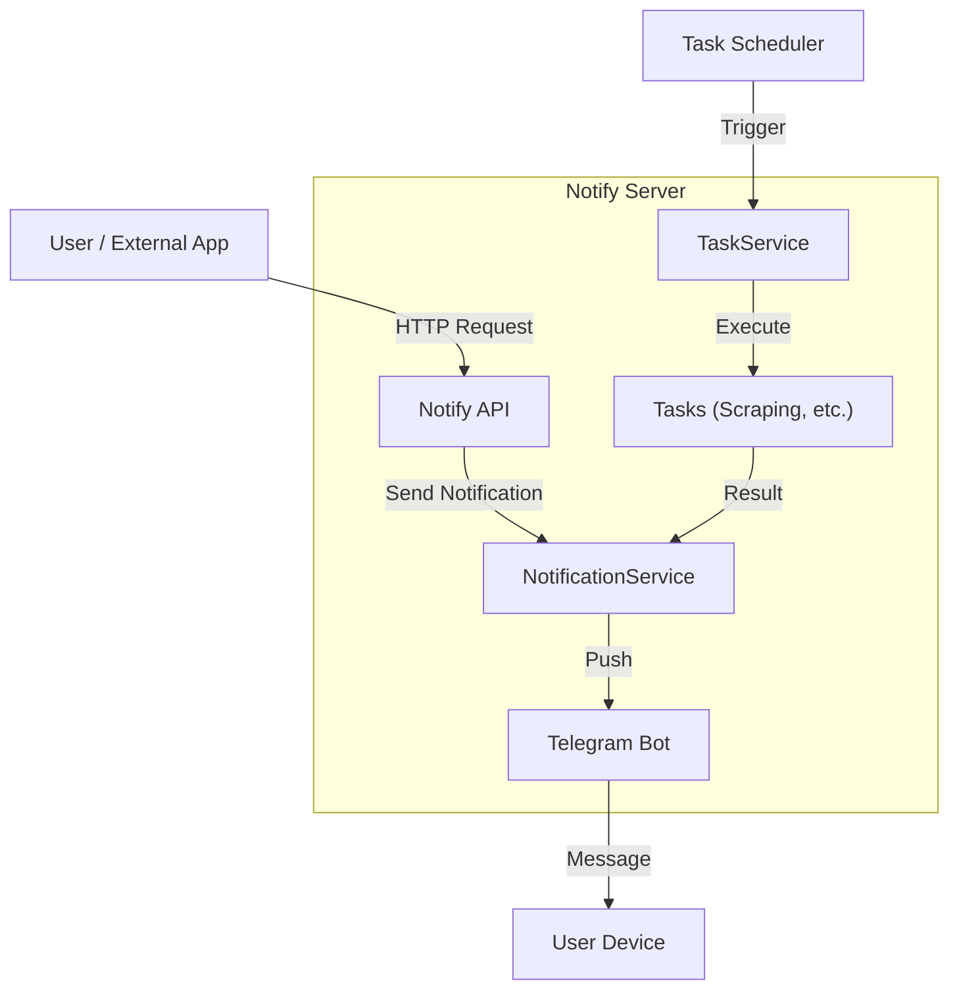

# NotifyServer

<p align="center">
  
  
  
  
  <a href="https://github.com/DarkKaiser/notify-server/blob/master/LICENSE">
    
  </a>
</p>

NotifyServer는 외부 프로그램으로부터 수신된 메시지 및 등록된 태스크들의 실행 결과를 텔레그램 등을 통해 알리는 서버입니다.

## 🌟 주요 기능

- **다양한 알림 채널**: 텔레그램 등 다양한 메신저 지원 (확장 가능)
- **스케줄링**: Cron 표현식을 사용한 정기적인 작업 실행
- **REST API**: 외부 애플리케이션 연동을 위한 API 제공
- **웹 스크래핑**: 웹 페이지 변동 감지 및 알림 (Lotto, 쇼핑몰 가격 등)

## 🏗 아키텍처



## 🚀 시작하기

### 전제 조건

- Docker & Docker Compose
- Go 1.23+ (로컬 개발 시)

### 설치 및 실행 (Docker)

1. **이미지 빌드**

   ```bash
   docker build -t darkkaiser/notify-server .
   ```

2. **컨테이너 실행**

   ```bash
   docker ps -q --filter name=notify-server | grep -q . && docker container stop notify-server && docker container rm notify-server

   docker run -d --name notify-server \
     -e TZ=Asia/Seoul \
     -v /usr/local/docker/notify-server:/usr/local/app \
     -v /usr/local/docker/nginx-proxy-manager/letsencrypt:/etc/letsencrypt:ro \
     -p 2443:2443 \
     --restart="always" \
     darkkaiser/notify-server
   ```

## 📝 설정 가이드

`notify-server.json` 파일을 통해 서버 동작을 설정합니다.

```json
{
  "debug": true,
  "notifiers": {
    "default_notifier_id": "my-telegram",
    "telegrams": [
      {
        "id": "my-telegram",
        "bot_token": "YOUR_BOT_TOKEN",
        "chat_id": 123456789
      }
    ]
  },
  "notify_api": {
    "ws": {
      "listen_port": 2443,
      "tls_server": false
    }
  }
}
```

## 📚 API 문서

서버가 실행 중일 때 다음 주소에서 Swagger UI를 통해 API 문서를 확인할 수 있습니다.

- URL: `http://localhost:2443/swagger/index.html`

## 📖 Task 문서

지원하는 Task의 상세 설명과 설정 방법은 다음 문서를 참고하세요:

- [Task 상세 문서](docs/TASKS.md)

지원하는 Task 목록:

- **JDC** - 전남디지털역량교육 모니터링
- **JYIU** - 전남여수산학융합원 공지사항 및 교육 모니터링
- **KURLY** - 마켓컬리 상품 가격 모니터링
- **LOTTO** - 로또 번호 예측
- **NAVER** - 네이버 공연 정보 모니터링
- **NS** - 네이버쇼핑 가격 모니터링

## 🤝 Contributing

Contributions, issues and feature requests are welcome.<br />
Feel free to check [issues page](https://github.com/DarkKaiser/notify-server/issues) if you want to contribute.

## Author

👤 **DarkKaiser**

- Blog: [@DarkKaiser](https://www.darkkaiser.com)
- Github: [@DarkKaiser](https://github.com/DarkKaiser)
