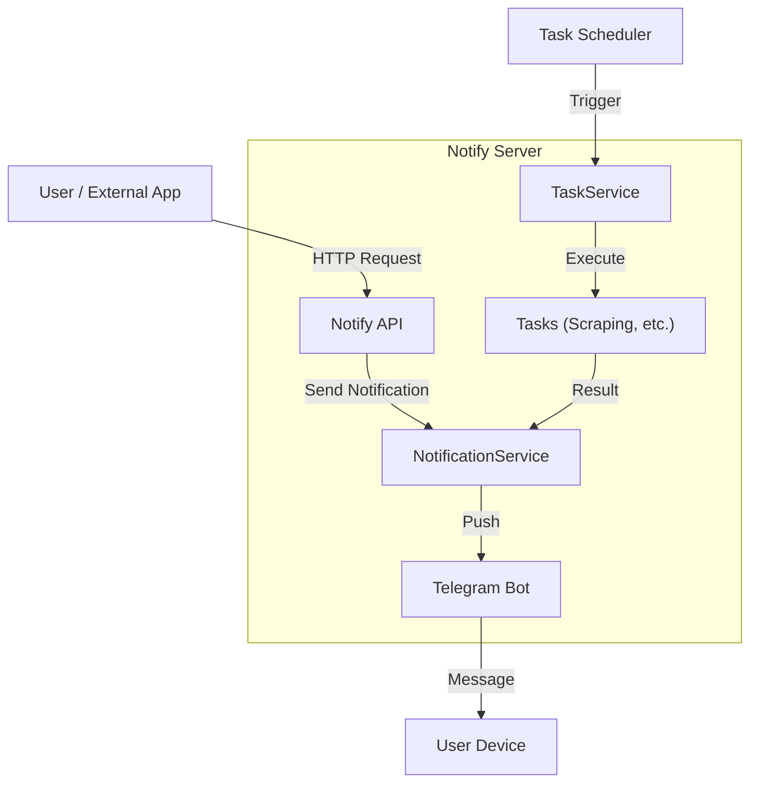
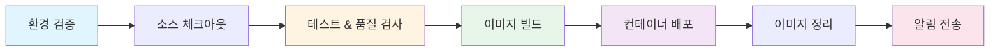

# NotifyServer

<p align="center">
  
  
  
  
  <a href="LICENSE">
    
  </a>
</p>

NotifyServer는 웹 스크래핑, 스케줄링, 외부 API 연동을 통해 다양한 정보를 수집하고, 텔레그램 등 메신저로 알림을 전송하는 통합 알림 서버입니다.

## 📚 목차

- [주요 기능](#-주요-기능)
- [아키텍처](#-아키텍처)
- [기술 스택](#-기술-스택)
- [시작하기](#-시작하기)
  - [전제 조건](#전제-조건)
  - [Docker로 실행](#docker로-실행)
  - [로컬에서 실행](#로컬에서-실행)
- [설정 가이드](#-설정-가이드)
- [API 문서](#-api-문서)
- [개발 가이드](#-개발-가이드)
- [CI/CD](#-cicd)

## 🌟 주요 기능

- **다양한 알림 채널**: 텔레그램 봇 연동 (확장 가능한 구조)
- **강력한 스케줄링**: Cron 표현식을 사용한 정기적인 작업 실행
- **웹 스크래핑**:
  - 쇼핑몰 가격 변동 감지 (네이버 쇼핑, 마켓컬리)
  - 공지사항 모니터링 (학교, 관공서)
  - 로또 번호 예측 및 당첨 확인
- **REST API**: 외부 애플리케이션 연동을 위한 API 제공
- **상태 모니터링**: 헬스체크 및 Swagger API 문서 제공

## 🏗 아키텍처



## 🛠 기술 스택

| 카테고리          | 기술             | 버전        |
| ----------------- | ---------------- | ----------- |
| **언어**          | Go               | 1.23+       |
| **웹 프레임워크** | Echo             | v4          |
| **스케줄러**      | Cron             | v3          |
| **문서화**        | Swagger (Swaggo) | Latest      |
| **컨테이너**      | Docker           | Alpine 3.20 |
| **CI/CD**         | Jenkins          | Latest      |
| **코드 품질**     | golangci-lint    | v1.62+      |

## 🚀 시작하기

### 📋 전제 조건

> **필수 요구사항**
>
> - Docker & Docker Compose
> - Go 1.23+ (로컬 개발 시)

### 🐳 Docker로 실행

#### 1️⃣ 이미지 빌드

```bash
docker build -t darkkaiser/notify-server .
```

#### 2️⃣ 컨테이너 실행

```bash
# 기존 컨테이너 정리 및 실행
docker rm -f notify-server || true

docker run -d --name notify-server \
  -e TZ=Asia/Seoul \
  -v $(pwd)/secrets:/usr/local/app/secrets \
  -v $(pwd)/logs:/usr/local/app/logs \
  -p 2443:2443 \
  --restart="always" \
  darkkaiser/notify-server
```

> **💡 팁**: 볼륨 마운트를 통해 설정 파일과 로그를 호스트에서 관리할 수 있습니다.

### 💻 로컬에서 실행

#### 1️⃣ 의존성 설치

```bash
go mod download
```

#### 2️⃣ Swagger 문서 생성

```bash
swag init
```

#### 3️⃣ 서버 실행

```bash
go run main.go
```

> **⚠️ 주의**: 로컬 실행 시 `notify-server.json` 설정 파일이 필요합니다.

## 📝 설정 가이드

### 기본 설정 구조

`notify-server.json` 파일을 통해 서버 동작을 설정합니다.

```json
{
  "debug": true,
  "notifiers": {
    "default_notifier_id": "my-telegram",
    "telegrams": [
      {
        "id": "my-telegram",
        "bot_token": "YOUR_BOT_TOKEN",
        "chat_id": 123456789
      }
    ]
  },
  "notify_api": {
    "ws": {
      "listen_port": 2443,
      "tls_server": false
    }
  }
}
```

### 주요 설정 항목

| 항목                            | 설명               | 필수 여부 |
| ------------------------------- | ------------------ | --------- |
| `debug`                         | 디버그 모드 활성화 | ❌        |
| `notifiers.default_notifier_id` | 기본 알림 채널 ID  | ✅        |
| `notifiers.telegrams`           | Telegram 봇 설정   | ✅        |
| `notify_api.ws.listen_port`     | API 서버 포트      | ✅        |
| `notify_api.ws.tls_server`      | HTTPS 사용 여부    | ❌        |

> **📌 참고**: 자세한 Task 설정은 [TASKS.md](docs/TASKS.md)를 참조하세요.

## 📚 API 문서

서버가 실행 중일 때 Swagger UI를 통해 API 문서를 확인하고 테스트할 수 있습니다.

### 접속 정보

| 항목             | URL                                                  |
| ---------------- | ---------------------------------------------------- |
| **Swagger UI**   | `https://api.darkkaiser.com:2443/swagger/index.html` |
| **Health Check** | `https://api.darkkaiser.com:2443/swagger/index.html` |

> **✨ Swagger UI에서 할 수 있는 것:**
>
> - API 엔드포인트 탐색
> - 실시간 API 테스트
> - 요청/응답 스키마 확인
> - 인증 토큰 테스트

## 💻 개발 가이드

### 📁 프로젝트 구조

```
notify-server/
├── 📂 service/
│   ├── 📂 api/           # REST API 서비스
│   ├── 📂 notification/  # 알림 서비스 (Telegram 등)
│   └── 📂 task/          # 스크래핑 및 작업 서비스
├── 📂 g/                 # 전역 설정 및 유틸리티
├── 📂 log/               # 로깅 유틸리티
├── 📂 docs/              # 문서
│   └── 📄 TASKS.md       # Task 상세 문서
└── 📂 secrets/           # 설정 파일 (Git 제외)
```

### 🔍 코드 품질 관리

프로젝트는 `golangci-lint`를 사용하여 코드 품질을 유지합니다.

```bash
# 린트 검사 실행
golangci-lint run ./...
```

### 🧪 테스트 실행

```bash
# 전체 테스트 실행
go test ./... -v

# 커버리지 포함 테스트
go test ./... -v -coverprofile=coverage.out

# 커버리지 리포트 확인
go tool cover -html=coverage.out

# 벤치마크 테스트
go test ./... -bench=. -benchmem
```

### 📊 테스트 구조

| 테스트 유형         | 설명                           | 파일 패턴               |
| ------------------- | ------------------------------ | ----------------------- |
| **단위 테스트**     | 각 모듈의 핵심 로직 검증       | `*_test.go`             |
| **통합 테스트**     | 실제 웹 페이지 스크래핑 테스트 | `*_integration_test.go` |
| **벤치마크 테스트** | 성능 측정 및 최적화            | `*_benchmark_test.go`   |

> **💡 팁**: `testdata/` 디렉토리에 실제 HTML 샘플을 저장하여 통합 테스트에 활용하세요.

### 🔨 빌드

```bash
# 로컬 빌드
go build -o notify-server .

# Docker 빌드 (테스트 포함)
docker build -t darkkaiser/notify-server .

# 특정 버전 태그로 빌드
docker build -t darkkaiser/notify-server:1.0.0 .
```

## 🔧 CI/CD

Jenkins를 통해 자동화된 빌드 및 배포 파이프라인이 구축되어 있습니다.

### 🔄 파이프라인 플로우



### 📋 파이프라인 단계

| 단계                      | 설명                    | 주요 작업                                |
| ------------------------- | ----------------------- | ---------------------------------------- |
| **1️⃣ 환경 검증**          | 필수 환경 변수 확인     | `TELEGRAM_BOT_TOKEN`, `TELEGRAM_CHAT_ID` |
| **2️⃣ 소스 체크아웃**      | Git 소스 코드 체크아웃  | 서브모듈 포함                            |
| **3️⃣ 테스트 & 품질 검사** | 테스트 및 커버리지 수집 | `go test`, `coverage.out` 아카이빙       |
| **4️⃣ 이미지 빌드**        | Docker 이미지 빌드      | `latest`, `{빌드번호}-{커밋해시}` 태그   |
| **5️⃣ 컨테이너 배포**      | 새 컨테이너 실행        | 기존 컨테이너 안전 교체                  |
| **6️⃣ 이미지 정리**        | 오래된 이미지 삭제      | 최근 5개 버전만 유지                     |
| **7️⃣ 알림 전송**          | 빌드 결과 알림          | Telegram 메시지 전송                     |

### 🏷️ 빌드 메타데이터

빌드된 이미지에는 다음 정보가 포함됩니다:

| 메타데이터     | 설명              | 예시                   |
| -------------- | ----------------- | ---------------------- |
| `GIT_COMMIT`   | Git 커밋 해시     | `abc1234`              |
| `BUILD_DATE`   | 빌드 시간 (UTC)   | `2025-12-01T14:00:00Z` |
| `BUILD_NUMBER` | Jenkins 빌드 번호 | `100`                  |

#### 확인 방법

```bash
# 이미지 레이블 확인
docker inspect darkkaiser/notify-server:latest | grep Labels -A 10

# 실행 중인 컨테이너의 버전 확인
docker logs notify-server | head -20
```

### 🔖 버전 관리

| 태그                    | 설명           | 용도          |
| ----------------------- | -------------- | ------------- |
| `latest`                | 항상 최신 빌드 | 프로덕션 배포 |
| `{빌드번호}-{커밋해시}` | 특정 버전      | 롤백, 디버깅  |

> **예시**: `100-abc1234`, `101-def5678`

#### 🔄 롤백 방법

```bash
# 특정 버전으로 롤백
docker stop notify-server
docker rm notify-server
docker run -d --name notify-server \
  -e TZ=Asia/Seoul \
  -v /usr/local/docker/notify-server:/usr/local/app \
  -p 2443:2443 \
  --restart="always" \
  darkkaiser/notify-server:100-abc1234
```

### 📊 로그 확인

| 명령어                                 | 설명            |
| -------------------------------------- | --------------- |
| `docker logs notify-server`            | 전체 로그       |
| `docker logs -f notify-server`         | 실시간 로그     |
| `docker logs --tail 100 notify-server` | 최근 100줄      |
| `docker logs -t notify-server`         | 타임스탬프 포함 |
| `docker logs --since 1h notify-server` | 최근 1시간      |

> **💡 팁**: `docker logs -f --tail 50 notify-server`로 최근 50줄부터 실시간 모니터링하세요.

## 🤝 Contributing

Contributions, issues and feature requests are welcome.<br />
Feel free to check [issues page](https://github.com/DarkKaiser/notify-server/issues) if you want to contribute.

## Author

👤 **DarkKaiser**

- Blog: [@DarkKaiser](https://www.darkkaiser.com)
- Github: [@DarkKaiser](https://github.com/DarkKaiser)
